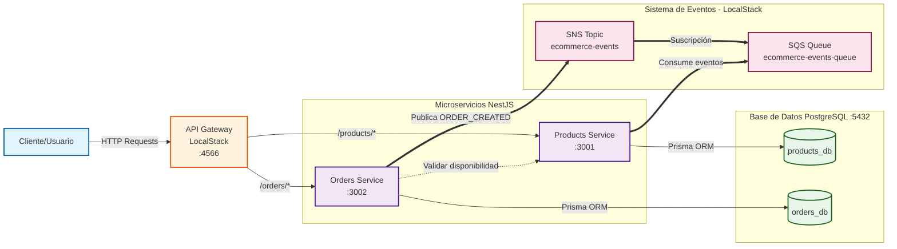

# Diagrama de Arquitectura - Sistema E-commerce

## Arquitectura de Microservicios con Event-Driven



## Descripción de Componentes

### Componentes Principales

| Componente           | Tecnología             | Puerto | Descripción                                                                                         |
| -------------------- | ---------------------- | ------ | --------------------------------------------------------------------------------------------------- |
| **API Gateway**      | LocalStack API Gateway | 4566   | Punto de entrada único para todas las peticiones HTTP. Enruta a los microservicios correspondientes |
| **Products Service** | NestJS + Prisma        | 3001   | Gestión del catálogo de productos, inventario y stock                                               |
| **Orders Service**   | NestJS + Prisma        | 3002   | Gestión de órdenes de compra y procesamiento de pedidos                                             |
| **PostgreSQL**       | PostgreSQL 16 Alpine   | 5432   | Base de datos relacional con dos esquemas separados                                                 |
| **SNS Topic**        | LocalStack SNS         | -      | Publicación de eventos de dominio (ecommerce-events)                                                |
| **SQS Queue**        | LocalStack SQS         | -      | Cola de mensajes suscrita al tópico SNS para procesamiento asíncrono                                |

### Bases de Datos

- **products_db**: Almacena información de productos, categorías, precios y stock
- **orders_db**: Almacena órdenes, items de órdenes y estado de pedidos

## Flujos de Comunicación

### 1. **Flujo HTTP Síncrono** (líneas sólidas →)

- El cliente realiza peticiones HTTP al API Gateway
- El API Gateway enruta las peticiones a los microservicios:
  - `/products/*` → Products Service
  - `/orders/*` → Orders Service
- Cada servicio responde directamente al cliente a través del gateway

### 2. **Flujo HTTP Directo** (líneas punteadas -.->)

- Orders Service valida disponibilidad de productos llamando directamente a Products Service
- Usado para validaciones síncronas antes de crear una orden

### 3. **Flujo Event-Driven Asíncrono** (líneas gruesas ==>)

1. **Publicación**: Orders Service publica evento `ORDER_CREATED` al SNS Topic cuando se crea una orden exitosamente
2. **Distribución**: SNS distribuye el evento a todos los suscriptores (SQS Queue)
3. **Consumo**: Products Service consume eventos de la SQS Queue
4. **Acción**: Products Service decrementa el stock de los productos ordenados

### Evento ORDER_CREATED

```typescript
{
  eventType: 'ORDER_CREATED',
  orderId: string,
  customerId: string,
  items: [{
    productId: string,
    quantity: number,
    unitPrice: number
  }],
  totalAmount: number,
  createdAt: string
}
```

## Ventajas de esta Arquitectura

✅ **Desacoplamiento**: Los servicios se comunican mediante eventos sin acoplamiento directo  
✅ **Escalabilidad**: Cada microservicio puede escalar independientemente  
✅ **Resiliencia**: Si un servicio falla, los eventos quedan en la cola para procesamiento posterior  
✅ **Separación de responsabilidades**: Cada servicio tiene su propia base de datos (Database per Service pattern)  
✅ **Desarrollo local**: LocalStack simula servicios AWS en entorno local sin costos

## Tecnologías Utilizadas

- **Backend**: NestJS (Node.js framework)
- **ORM**: Prisma
- **Base de Datos**: PostgreSQL 16
- **Mensajería**: AWS SNS + SQS (simulado con LocalStack)
- **API Gateway**: AWS API Gateway (simulado con LocalStack)
- **Contenedores**: Docker + Docker Compose
- **Cloud Local**: LocalStack

## Cómo Ejecutar

```bash
# Iniciar toda la infraestructura
docker-compose up -d

# Verificar servicios en ejecución
docker-compose ps

# API Gateway endpoint
http://localhost:4566/_aws/execute-api/{API_ID}/dev/products
http://localhost:4566/_aws/execute-api/{API_ID}/dev/orders

# Acceso directo a servicios (desarrollo)
http://localhost:3001/products  # Products Service
http://localhost:3002/orders    # Orders Service
```

---

**Fecha de creación**: Abril 5, 2026  
**Versión**: 1.0
